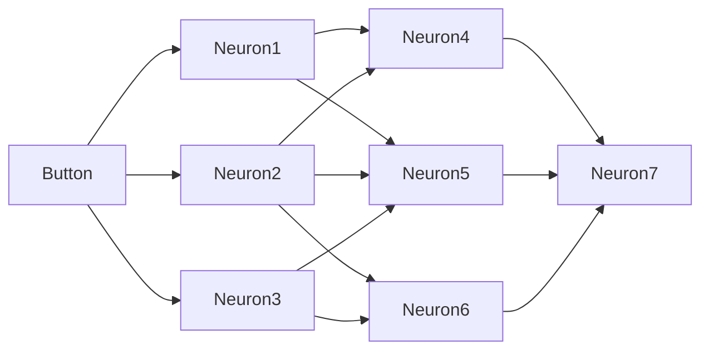

# Simple-Angular-Neural-Network

## Repository Goal

Generate a simple neural network for display purposes. This should be the first of a series that builds complexity with each iteration.

This first iteration seeks to reproduce the following neural network:

The user presses a button to signal stimalating neurons 1, 2, and 3. This processes down the chain and eventually stimulates neuron 7.

On press of the button, the neuron will either be stimulated to fire and thus cause it to stimulate other neurons down the chain or will not reach enough potential to cause a fire event.

Users will be able to edit the weights of each of the connections to other neurons and thus similate how a neural network might interact in real-time.
